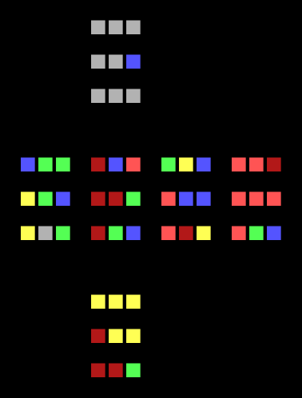
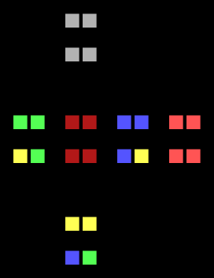

# Rubik's Cube AI

The goal of this project is to make a simple AI learn a Rubik's Cube from scratch, provided no prior knowledge of the puzzle.
No algorithms specific to solving Rubik's Cubes are in place, so the AI learns solely through trial and error.

```rubiks.py``` creates and scrambles a Rubik's Cube, and can output a flattened, coloured visual representation to the console.
Currently, only the rotation of faces is supported, so cubes larger than 3x3x3 cannot be fully manipulated.

```ai_learner.py``` attempts to solve a Rubik's Cube strictly through reinforcement learning, using a simple Neural Network.
Simple heuristics are in place to reward the AI; primarily, it is concerned with the number of correct colours on each face of the cube.
Extra points are given if corner blocks are correct for all of their adjacent sides.
Checks for entirely-correct edge blocks is not yet in place.

A <a href="https://pytorch.org/tutorials/intermediate/reinforcement_q_learning.html">PyTorch tutorial</a> was roughly followed to implement the starting AI.

Dependencies
-----
*	<b>Numpy</b>
*	<b>PyTorch</b>

Performance
-----
Due to the complexity of the puzzle and the simplicity of the AI, it's unlikely to solve large cubes as of yet; regardless, the AI fares substantially better than if random choices were taken.
Random choice gives a short-term average of ```4``` correct colours for a 2x2x2 cube, and ```14``` for a 3x3x3 cube.
The AI may sustain an average of ```15+``` and ```29+``` correct colours respectively within a few minutes of learning.
Note that these numbers are only taking into account the colour of individual squares, not the correctness of entire blocks.

The AI's performance is currently affected by local maxima, possibly stagnating when close to solutions.
This is mediated by a high base rate of randomness, although a better solution will be attempted in the near future.

Below are the best solutions found between the AI and random choice, each allowed up to 600,000 rotations (4 minutes).
The AI is not trained on previous cubes before this benchmark.
2x2x2 cubes are usually solved within 100,000 rotations.

<br>
<div align="center">
	<figure>
		
		<p align="middle">
			<figcaption>AI: 40 Correct</figcaption>
		</p>
		
		<p align="middle">
			<figcaption>Random: 30 Correct</figcaption>
		</p>
	</figure>
</div>
<div align="center">
	<figure>
		
		<p align="middle">
			<figcaption>AI: 24 Correct</figcaption>
		</p>
		
		<p align="middle">
			<figcaption>Random: 20 Correct</figcaption>
		</p>
	</figure>
</div>
<br>
<div align="center">
	<figure>
		
		<p align="middle">
			<figcaption>AI: 2x2x2 Cube Solution Stats</figcaption>
		</p>
	</figure>
</div>