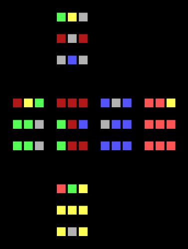

# Rubik's Cube AI

The goal of this project is to make a simple AI learn a Rubik's Cube from scratch, provided with no prior knowledge of the puzzle.
No algorithms specific to solving Rubik's Cubes are in place, so the AI learns solely through trial and error.

```rubiks.py``` creates and scrambles a Rubik's Cube, and can output a flattened, coloured visual representation to the console.
Currently only supports the rotation of faces, and so cubes larger than 3x3x3 cannot be fully manipulated.

```ai_learner.py``` attempts to solve a Rubik's Cube strictly through reinforcement learning.
A shallow Neural Network is currently used, and more emphasis is placed on not overfitting, rather than learning quickly.
Simple heuristics are in place to reward the AI; primarily, it is concerned with the number of correct colours on each face of the cube.
Extra points are given if corner pieces are correct for all adjacent sides.

A <a href="https://pytorch.org/tutorials/intermediate/reinforcement_q_learning.html">PyTorch tutorial</a> was roughly followed to implement the AI.

Dependencies
-----
*	<b>Numpy</b>
*	<b>PyTorch</b>

Performance
-----
Due to the complexity of the puzzle and the simplicity of the AI, it's unlikely to solve a cubes larger than 2x2x2; regardless, the AI fares significantly better than if random choices were taken.
Random choices gives a short-term sustained number of correct colours of ```4``` for a 2x2x2 cube, and ```14``` for a 3x3x3 cube.
This AI may sustain an average of ```10+``` and ```23+``` correct colours respectively within an hour of learning.

Below are the best solutions found between the AI and random choice, each allowed up to 600,000 rotation.
A 2x2x2 cube was solved in 1 minute (70,000 rotations), and was the first cube encountered by the AI.

<br>
<div align="center">
	<figure>
		
		<p align="middle">
			<figcaption>AI: 36 Correct</figcaption>
		</p>
		
		<p align="middle">
			<figcaption>Random: 30 Correct</figcaption>
		</p>
	</figure>
</div>
<br>
<div align="center">
	<figure>
		
		<p align="middle">
			<figcaption>AI: 24 Correct</figcaption>
		</p>
		
		<p align="middle">
			<figcaption>Random: 20 Correct</figcaption>
		</p>
	</figure>
</div>