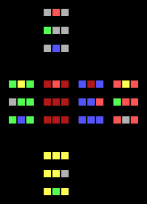

# Rubik's Cube AI

The goal of this project is to make a simple AI learn a Rubik's Cube from scratch, provided no prior knowledge of the puzzle.
No algorithms specific to solving Rubik's Cubes are in place, so the AI learns solely through trial and error.

```rubiks.py``` creates and scrambles a Rubik's Cube, and can output a flattened, coloured visual representation to the console.
Currently, only the rotation of faces is supported, so cubes larger than 3x3x3 cannot be fully manipulated.

```ai_learner.py``` attempts to solve a Rubik's Cube strictly through Deep Q-Learning.
The current reward system primarily focuses on the number of entirely-correct blocks.

There are two simple rules in place, to expedite the learning:
*	Don't counter the previous rotation
*	Don't make the same rotation 4 times consecutively

A <a href="https://pytorch.org/tutorials/intermediate/reinforcement_q_learning.html">PyTorch tutorial</a> was roughly followed to implement the starting AI.

## Dependencies
*	<b>Numpy</b>
*	<b>PyTorch</b>

## Usage
Run with the following command:

```
python ai_learner.py [OPTIONS]
```

Options:
*	```-s N | --size=N```: Cube size (number of squares per edge). Default: 2
*	```-l N | --layers=N```: Number of layers in the neural network. Default: 3
*	```--seed=N```: Set the RNG seed
*	```--random```: Only use random choice
*	```-h | --help```: Display the help page and exit

## Performance
Due to the complexity of the puzzle and the simplicity of the AI, it's unlikely to solve large cubes as of yet; regardless, the AI fares substantially better than if random choices were taken.
Random choice gives a short-term average of ```1``` correct block for a 2x2x2 cube, and ```7``` for a 3x3x3 cube.
The AI may sustain an average of ```6+``` and ```14+``` correct blocks respectively within an hour of learning.
Correct corner pieces are easy to achieve, but great difficulty comes with then also correcting the edge pieces.

Below are the best solutions found between the AI and random choice, each allowed up to 600,000 rotations (5 minutes) on 5 different Rubik's Cubes.

<div align="center">

AI             |  Random Choice
:-------------------------:|:-------------------------:
  |  
3x3x3: 38 Correct | 3x3x3: 23 Correct
 | 
2x2x2: 24 Correct | 2x2x2: 15 Correct

</div>
<br>

Given a few hours of training, 2x2x2 cubes are usually solved within 10,000 rotations.
See below for results late into the learning process.

<div align="center">
	<figure>
		
		<p align="middle">
			<figcaption>AI: 2x2x2 Cube Solution Stats</figcaption>
		</p>
	</figure>
</div>