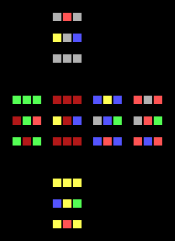
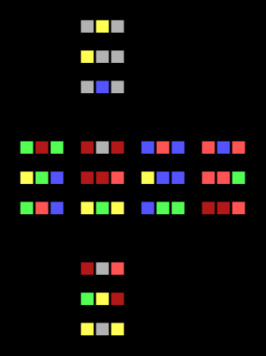
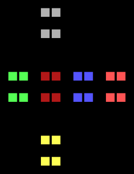
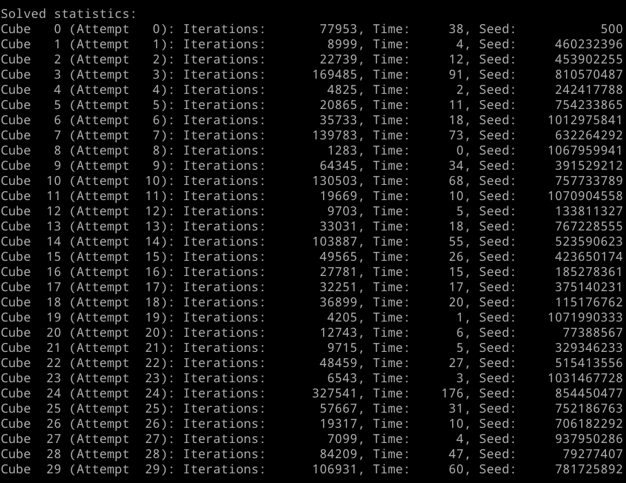

# Rubik's Cube AI

The goal of this project is to make a simple AI learn a Rubik's Cube from scratch, provided no prior knowledge of the puzzle.
No algorithms specific to solving Rubik's Cubes are in place, so the AI learns solely through trial and error.

```rubiks.py``` creates and scrambles a Rubik's Cube, and can output a flattened, coloured visual representation to the console.
Currently, only the rotation of faces is supported, so cubes larger than 3x3x3 cannot be fully manipulated.

```ai_learner.py``` attempts to solve a Rubik's Cube strictly through reinforcement learning, using a simple Neural Network.
Simple heuristics are in place to reward the AI; primarily, it is concerned with the number of correct blocks.
Extra points are given if corner blocks and edge blocks are correct for all of their sides.

A <a href="https://pytorch.org/tutorials/intermediate/reinforcement_q_learning.html">PyTorch tutorial</a> was roughly followed to implement the starting AI.

## Dependencies
*	<b>Numpy</b>
*	<b>PyTorch</b>

## Performance
Due to the complexity of the puzzle and the simplicity of the AI, it's unlikely to solve large cubes as of yet; regardless, the AI fares substantially better than if random choices were taken.
Random choice gives a short-term average of ```1``` correct blocks for a 2x2x2 cube, and ```7``` for a 3x3x3 cube.
The AI may sustain an average of ```10+``` and ```17+``` correct blocks respectively within a few minutes of learning.
Correct corner pieces are easy to achieve, but great difficulty comes with then also correcting the edge pieces.

Local maxima has a large impact on the AI's performance, possibly stagnating when nearing solutions.
Extra randomness is introduced when duplicate states are encountered in a short period of time, which alleviates this greatly.

Below are the best solutions found between the AI and random choice, each allowed up to 600,000 rotations (5 minutes) on 5 different Rubik's Cubes.
2x2x2 cubes are usually solved within 50,000 rotations.

<div align="center">

AI             |  Random Choice
:-------------------------:|:-------------------------:
  |  
3x3x3: 34 Correct | 3x3x3: 23 Correct
 | 
2x2x2: 24 Correct | 2x2x2: 15 Correct

</div>
<br>
<div align="center">
	<figure>
		
		<p align="middle">
			<figcaption>AI: 2x2x2 Cube Solution Stats</figcaption>
		</p>
	</figure>
</div>